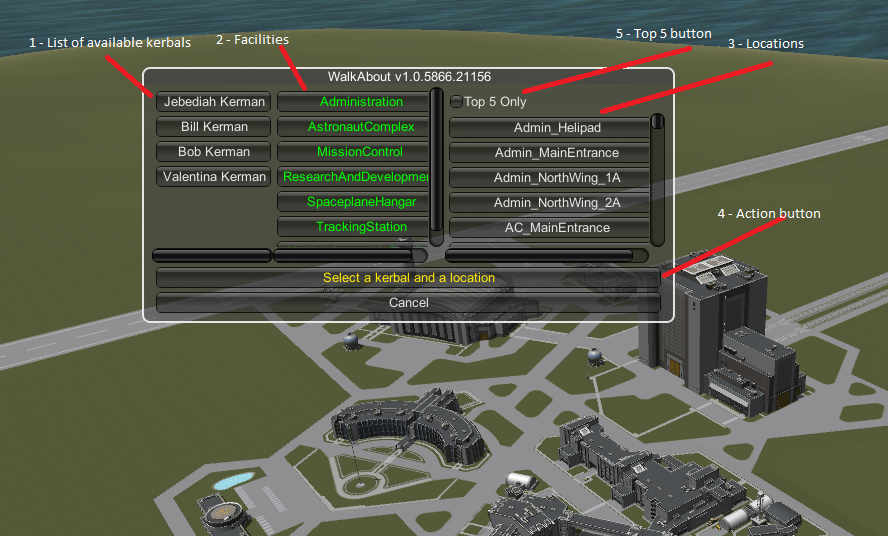
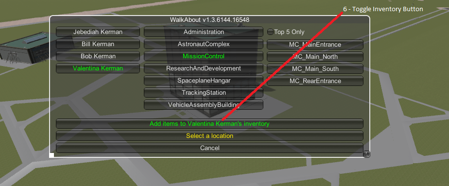
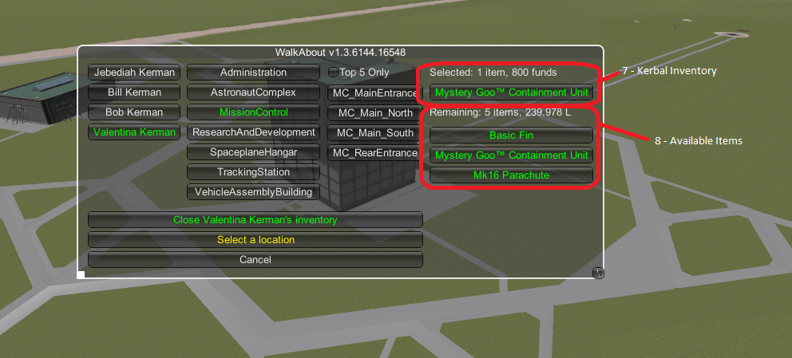

# WalkAbout : UNOFFICIAL

This is a unofficial, informal repository for **WalkAbout** for historical reference and troubleshooting.

## In a Hurry
* [Binaries](https://github.com/net-lisias-ksph/WalkAbout/tree/Archive)
* Sources
	+ WiP
* [Change Log](./CHANGE_LOG.md)

## Description

Do you need Bob to hike a few kms to get to that hard-to-land-at location? Have you been annoyed that in order to have a kerbal on EVA around the KSC, you have to build a craft and launch it? Don't want to recover and rebuild that aircraft on the tarmac just to add a new barometer?

Then this the mod for you!

Move your kerbals on EVA without having to hold down the W-A-S-D keys for 20 minutes. Place any kerbal available in the Astronaut Complex outside any door anywhere around the KSC. It's as simple as that! Dispatch a kerbal with the required inventory to repair or update your craft (requires Kerbal Inventory System).

### Placement 

You can activate WalkAbout from the Space Centre scene by pressing ctrl-W. The WalkAbout selections screen will appear.

1. List of available kerbals.
	* any kerbal currently not assigned to a craft or on EVA will appear in this list.  Simply click on a kerbal to select that one.
2. Facilities
	* a list of the KSC facilities with locations for placing kerbals.  Click on one of these to restrict the list of Locations (see below) to only those locations associated with the facility.
3. Locations
	* list of all locations where a kerbal may be placed. Or, if a facility has been selected, a list of all locations associated with that facility.  See notes 1, 2, 3 and 4.
4. Action Button
	* when the button text is green, click it to send your kerbal on WalkAbout.
5. Top 5 Button
	* Restricts the locations shown to only the top 5 most commonly selected locations.  See notes 3, 4 and 5.

For players who use the Kerbal Inventory System mod:

6. Toggle Inventory Button (only appears if the Kerbal Inventory System mod is installed)
	* turns the inventory display on or off
7. Kerbal's Inventory
	* lists all items in the selected kerbal's inventory.
8. Available Items
	* list all items that can be added to the kerbal's inventory.

#### Note 1

Locations are recorded in the .loc files.  Each location corresponds to a position just outside of one of the doors found on the outside of the buildings of the KSC.  

I have tried to catalogue every door available at each of the 3 levels of upgrade for all of the buildings, but as you may imagine, it would be easy for me to miss one (or two (or three (...)))).  If you notice any doors or exits that I have missed, please let me know on the forum page.

#### Note 2:
Since the individual buildings in KSP are not named, I tried to come up with a generic naming convention for the buildings and the locations.  Most location names are formatted as follows *ff_bldg[\_subsection]\_[d]ls* where

* ff is an abbreviation of the facility name,
* bldg is a name for the building
* subsection may be a wing or a separate building name (eg ..._QuonsetF_...)
* d is the direction the side of the building faces (N, S, E, W)
* l is the floor #
* s is the sequence letter for the door (A, B, C...).

So R+D\_WindTunnel\_BldgC\_N1B is 2nd door on the first floor of the north side of Building C of the Wind Tunnel complex of the R&D facility.

#### Note 3:

When the selection screen first appears, all locations for all facilities are shown.  Use the Facilities selector and/or the Top 5 button to limit the number of locations shown.

#### Note 4:

Locations are shown in alphabetical order.  However, each time a location is used, it is moved up the list thereby keeping the most often used locations at the top of list.  

#### Note 5:

The Top 5 button is not limited to 5 entries.  The number of locations selected by this button can be set by altering the value for TopFew in the settings.cfg file.

#### Note 6:

Placing kerbals in locations where a portion of the building is above them has proven problematic. As a result locations for doors on all but the bottom and top levels of most stairwells have been omitted. This is also why kerbals are placed beyond any projecting awnings and eaves.

### Perpetual Motion

When a kerbal is on EVA, it is now possible to walk/swim or run without having to hold down the movement keys. To do this enter Perpetual Motion mode by pressing the activation key (single quote ['] - see note 1). Your kerbal should now start walking forward (see note 2).

* The movement keys (W-A-S-D) will now change your kerbal's direction of movement. See note 2.
* The run key (left-shift) will act as a toggle, switching your kerbal's movement between walking and running.
* Time acceleration is limited to physics time-warp only (1x, 2x, 3x, 4x).
* Pressing the activation key again will take you out of Perpetual Motion mode.

#### Note 1:

The activation key is configurable in the settings.cfg file.

#### Note 2:

In Perpetual Motion mode the kerbal always moves forward (in the direction it is facing).

#### Note 3

Direction change is relative to the camera. So pressing W turns the kerbal to same direction as camera is facing.

## License

This AddOn is (C) [Antipodes](https://forum.kerbalspaceprogram.com/index.php?/profile/157104-antipodes/) and licensed under [GPLv3](https://www.gnu.org/licenses/gpl-3.0.txt).

You are authorized to fork this repository under GitHub [ToS](https://help.github.com/articles/github-terms-of-service/) **and** the License above.

## References

* [Antipoes](https://forum.kerbalspaceprogram.com/index.php?/profile/157104-antipodes/)
	+ [KSP Forum](https://forum.kerbalspaceprogram.com/index.php?/topic/130575-13-walkabout-v171-17-07-2017/)
	+ [SpaceDock](https://www.spacedock.info/mod/228/WalkAbout)
